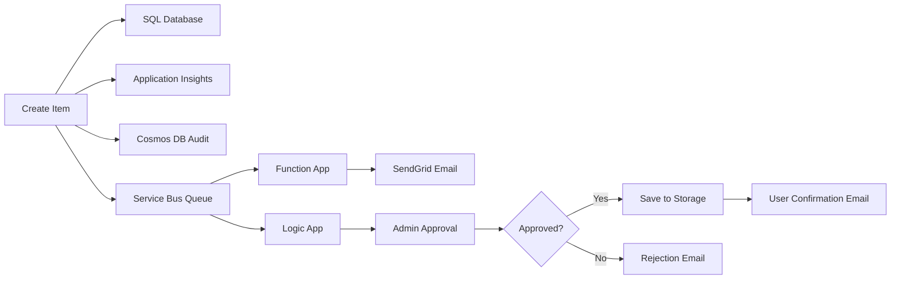

# Quick Start: Azure Services Integration

## What's Been Implemented

I've added **6 out of 7 Azure services** to your RegistrationApp project. Here's what's ready:

### ✅ Implemented (Code Complete)

1. **Azure Key Vault** - Securely store connection strings and secrets
2. **Azure Application Insights** - Monitor app performance and track events
3. **Azure Storage Account** - Upload and manage files (images, documents)
4. **Azure Service Bus** - Async messaging for email notifications
5. **Azure Cosmos DB** - Audit logs with timestamps and details

### ⏳ To Implement (Code Structure Ready)

6. **Azure Functions** - Serverless tasks (email sending, report generation)
7. **Azure Logic Apps** - No-code workflow automation

---

## Files Created

```
backend/
├── Services/
│   ├── KeyVaultService.cs ...................... Retrieve secrets
│   ├── ApplicationInsightsService.cs ........... Track events/metrics
│   ├── AzureStorageService.cs .................. File upload/download
│   ├── AzureServiceBusService.cs ............... Message queuing
│   └── AzureCosmosDbService.cs ................. Audit logging
├── Controllers/
│   └── ItemsController.cs (updated) ........... Added Azure service calls
├── appsettings.json (updated) ................. Added Azure service configs
└── Program.cs (updated) ....................... Registered all services

Documentation/
├── AZURE_INTEGRATION_GUIDE.md ................. Complete setup instructions
├── AZURE_NUGET_PACKAGES.md .................... Required NuGet packages
└── AZURE_IMPLEMENTATION_CHECKLIST.md ......... Implementation tracking
```

---

## 5-Minute Quick Start

### Step 1: Install NuGet Packages

```bash
cd backend

# Azure Key Vault
dotnet add package Azure.Identity
dotnet add package Azure.Security.KeyVault.Secrets
dotnet add package Azure.Extensions.AspNetCore.Configuration.Secrets

# Azure Storage
dotnet add package Azure.Storage.Blobs

# Azure Service Bus
dotnet add package Azure.Messaging.ServiceBus

# Azure Cosmos DB
dotnet add package Azure.Cosmos

# Azure Application Insights
dotnet add package Microsoft.ApplicationInsights.AspNetCore

# Restore
dotnet restore
```

### Step 2: Create Azure Resources

```bash
# Login to Azure
az login

# Create resource group
az group create --name rg-registration-app --location eastus

# Create Key Vault
az keyvault create --resource-group rg-registration-app --name kv-registrationapp --location eastus

# Create Storage Account
az storage account create --resource-group rg-registration-app --name stregistrationapp --location eastus

# Create Service Bus
az servicebus namespace create --resource-group rg-registration-app --name sb-registrationapp --location eastus

# Create Cosmos DB
az cosmosdb create --resource-group rg-registration-app --name cosmos-registrationapp

# Create Application Insights
az monitor app-insights component create --app insights-registrationapp --resource-group rg-registration-app --location eastus
```

### Step 3: Configure Connection Strings

Get connection strings from Azure resources and update `appsettings.json`:

```json
{
  "ConnectionStrings": {
    "DefaultConnection": "...",
    "AzureStorageAccount": "DefaultEndpointsProtocol=https;AccountName=stregistrationapp;...",
    "AzureServiceBus": "Endpoint=sb://sb-registrationapp.servicebus.windows.net/;...",
    "AzureCosmosDb": "AccountEndpoint=https://cosmos-registrationapp.documents.azure.com:443/;..."
  },
  "AzureKeyVault": {
    "VaultUri": "https://kv-registrationapp.vault.azure.net/"
  },
  "ApplicationInsights": {
    "InstrumentationKey": "YOUR_KEY_HERE"
  }
}
```

### Step 4: Run & Test

```bash
# Run locally
dotnet run

# Access API
http://localhost:5000/swagger

# Test endpoint
POST /api/items
{
  "name": "Test Item",
  "description": "Testing Azure services"
}

# Verify in Azure
# - Check Storage for uploaded files
# - Check Service Bus queues for messages
# - Check Cosmos DB for audit logs
# - Check Application Insights for events
```

---

## What Each Service Does

### 1. Azure Key Vault 🔐
**Purpose**: Store secrets securely (no hardcoding in code)

**Usage**:
```csharp
private readonly IKeyVaultService _keyVaultService;

public async Task Setup()
{
    var secret = await _keyVaultService.GetSecretAsync("SqlConnectionString");
}
```

**Learn**: Secret management, access control, audit trails

---

### 2. Azure Application Insights 📊
**Purpose**: Monitor application performance and track custom events

**Usage**:
```csharp
private readonly IApplicationInsightsService _appInsights;

public void CreateItem(Item item)
{
    _appInsights.TrackEvent("ItemCreated", 
        new Dictionary<string, string> { { "ItemId", item.Id.ToString() } });
}
```

**Learn**: Monitoring, diagnostics, performance metrics, alerting

---

### 3. Azure Storage Account 📁
**Purpose**: Store files (images, documents) in the cloud

**Usage**:
```csharp
private readonly IAzureStorageService _storage;

public async Task<string> UploadImage(IFormFile file)
{
    return await _storage.UploadFileAsync(file, "item-images");
}
```

**Learn**: Blob storage, file management, SAS tokens, access levels

---

### 4. Azure Service Bus 📬
**Purpose**: Send messages asynchronously (email notifications, events)

**Usage**:
```csharp
private readonly IAzureServiceBusService _serviceBus;

public async Task CreateItem(Item item)
{
    await _serviceBus.SendMessageAsync("item-created-queue", item);
}
```

**Learn**: Message queues, topics, subscriptions, event-driven architecture

---

### 5. Azure Cosmos DB 📝
**Purpose**: Store audit logs (who did what, when)

**Usage**:
```csharp
private readonly IAzureCosmosDbService _cosmos;

public async Task CreateItem(Item item)
{
    await _cosmos.LogAuditAsync(new AuditLog
    {
        ItemId = item.Id.ToString(),
        Action = "Created",
        ItemName = item.Name,
        Timestamp = DateTime.UtcNow
    });
}
```

**Learn**: NoSQL databases, document storage, partition keys, queries

---

### 6. Azure Functions ⚡
**Purpose**: Serverless automation (process messages, send emails)

**Example**: When item is created → send email notification

**Learn**: Serverless computing, event triggers, cost optimization

---

### 7. Azure Logic Apps 🔗
**Purpose**: No-code workflow automation (approval workflows, notifications)

**Example**: 
1. Item created → 
2. Send approval email → 
3. If approved → send confirmation → 
4. Save to storage

**Learn**: Workflow automation, integrations, business processes

---

## Testing Workflow



---

## Key Learning Points

✅ **Configuration Management**: Use Key Vault for secrets
✅ **Monitoring**: Track events with Application Insights
✅ **File Storage**: Upload files to Cloud Storage
✅ **Messaging**: Async processing with Service Bus
✅ **NoSQL Database**: Audit logs in Cosmos DB
✅ **Serverless**: Process events with Functions
✅ **Workflows**: Automate with Logic Apps

---

## Next: Azure Functions (15 min setup)

Ready to add Azure Functions? Here's what to do:

```bash
# 1. Create new Functions project
func init ItemNotificationFunction --dotnet

# 2. Create function
func new --name SendEmailNotification --template "Service Bus Queue trigger"

# 3. Install SendGrid NuGet
dotnet add package SendGrid

# 4. Update function code (see AZURE_INTEGRATION_GUIDE.md)

# 5. Deploy to Azure
func azure functionapp publish func-registrationapp
```

---

## Next: Azure Logic Apps (30 min setup)

Ready to create a no-code workflow?

1. Go to Azure Portal → Logic Apps
2. Create new Logic App
3. Add trigger: "When SQL row is inserted"
4. Add action: "Send email approval"
5. Add condition: "If approved"
6. Add actions: Send confirmation, save to storage
7. Save and deploy

---

## Support & Troubleshooting

**Connection String Issues**:
```bash
# View stored secrets
az keyvault secret list --vault-name kv-registrationapp
```

**Storage Upload Failed**:
```bash
# Check storage account exists
az storage account list --resource-group rg-registration-app
```

**Service Bus Not Receiving Messages**:
```bash
# Check queue exists
az servicebus queue list --resource-group rg-registration-app --namespace-name sb-registrationapp
```

**Cosmos DB Connection Error**:
```bash
# Verify account exists
az cosmosdb list --resource-group rg-registration-app
```

---

## Architecture Diagram

```
┌─────────────────────────────────────┐
│      Frontend (Angular)             │
│   http://localhost:4200             │
└──────────────┬──────────────────────┘
               │ HTTP Requests
               ▼
┌─────────────────────────────────────┐
│    Backend API (.NET 8.0)           │
│    http://localhost:5000            │
└──────────────┬──────────────────────┘
               │
      ┌────────┼────────┬─────────┬──────────┐
      ▼        ▼        ▼         ▼          ▼
   ┌────┐  ┌──────┐  ┌──────┐  ┌──────┐  ┌──────┐
   │SQL │  │Store │  │Service  │Cosmos │  │ Insights│
   │DB  │  │Blob  │  │ Bus    │  DB   │  │        │
   └────┘  └──────┘  └──────┘  └──────┘  └──────┘
      │        │       │         │         │
      └────────┴───────┴─────────┴─────────┘
            Azure Services
```

---

## File Upload Test

```bash
# Create item
curl -X POST http://localhost:5000/api/items \
  -H "Content-Type: application/json" \
  -d '{"name":"Test","description":"Test"}'

# Upload image
curl -X POST http://localhost:5000/api/items/1/upload-image \
  -F "file=@image.jpg"

# Response:
# {
#   "url": "https://stregistrationapp.blob.core.windows.net/item-images/...",
#   "message": "Image uploaded successfully"
# }
```

---

## Audit Log Test

```bash
# Get audit logs for item 1
curl http://localhost:5000/api/items/analytics/audit-logs/1

# Response:
# [
#   {
#     "id": "...",
#     "itemId": "1",
#     "action": "Created",
#     "itemName": "Test",
#     "timestamp": "2026-02-05T10:30:00Z",
#     "details": {...}
#   }
# ]
```

---

## Cost Savings Tips

1. **Use Cosmos DB Serverless** for lower baseline cost
2. **Set Service Bus auto-delete** for old messages
3. **Enable Storage lifecycle policies** to archive old files
4. **Use Function App Consumption Plan** for pay-as-you-go
5. **Monitor RU usage** in Cosmos DB

---

## Estimated Timeline

- **Today**: Install packages, test locally (2 hours)
- **Week 1**: Deploy to Azure, test all services (4 hours)
- **Week 2**: Implement Azure Functions (3 hours)
- **Week 3**: Create Logic App workflows (2 hours)
- **Week 4**: Optimization and monitoring (3 hours)

**Total**: ~14 hours to master all 7 services

---

## Success Checklist

- [ ] All NuGet packages installed
- [ ] Code compiles without errors
- [ ] All Azure services created
- [ ] Connection strings configured
- [ ] Application Insights events appearing
- [ ] Files uploaded to Storage
- [ ] Messages in Service Bus queue
- [ ] Audit logs in Cosmos DB
- [ ] Functions processing messages
- [ ] Logic App workflow running

---

**Ready to Start?** 🚀

1. Run: `dotnet restore`
2. Follow: AZURE_INTEGRATION_GUIDE.md
3. Check: AZURE_IMPLEMENTATION_CHECKLIST.md
4. Test: Each service endpoint

---

**Status**: ✅ Code Complete, Ready for Azure Deployment
**Difficulty**: Intermediate
**Time to Deploy**: 2-3 weeks
**Learning Value**: ⭐⭐⭐⭐⭐ (5/5)

Questions? Check the troubleshooting section in AZURE_INTEGRATION_GUIDE.md!
